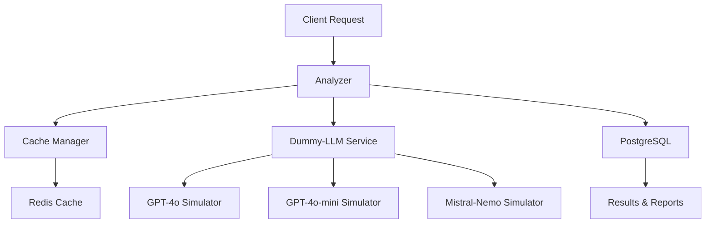

# Sistema de Análisis de Cache con Dummy-LLM

[](https://opensource.org/licenses/MIT)
[](https://www.python.org/downloads/)
[](https://www.docker.com/)

Sistema académico para análisis comparativo de políticas de cache con **modelos LLM simulados** (Dummy-LLM), diseñado para testing y desarrollo sin dependencias externas de APIs.

## 🚀 Características Principales

- **🤖 Dummy-LLM**: Simulación realista de 3 modelos (GPT-4o, GPT-4o-mini, Mistral-Nemo)
- **⚡ Cache Inteligente**: 15 configuraciones diferentes (LRU, TTL, TTL-LRU)
- **📊 Análisis Completo**: Métricas detalladas de rendimiento y calidad
- **🐳 Docker Ready**: Despliegue completo con un solo comando
- **📈 Visualización**: Gráficos automáticos y reportes detallados
- **🔄 Sin APIs Externas**: Sistema completamente autónomo
- **📊 Dataset Real**: Yahoo Answers con 5,000+ preguntas
- **🎯 Determinista**: Resultados consistentes y reproducibles

## 📋 Componentes del Sistema

### Servicios Docker

| Servicio | Función | Puerto | Descripción |
|----------|---------|--------|-------------|
| **PostgreSQL** | Base de datos principal | 5432 | Almacena dataset y resultados |
| **Redis** | Sistema de cache | 6379 | Implementa políticas de cache |
| **Analyzer** | Motor de análisis | - | Ejecuta experimentos y genera reportes |

### Componentes Python

- **`dummy_llm_service.py`**: Simulador de modelos LLM sin APIs externas
- **`analyzer.py`**: Motor principal de análisis y experimentación
- **`cache_manager.py`**: Gestor de políticas de cache Redis
- **`database.py`**: Gestor de conexión y esquema PostgreSQL
- **`load_data.py`**: Cargador del dataset Yahoo Answers

## 🚀 Inicio Rápido

### Método Recomendado: Docker (Un Solo Comando)

```bash
# Despliegue completo automático
docker-compose up --build

# Análisis con volumen personalizado
docker-compose run --rm analyzer python analyzer.py --requests 1000
```

**¿Qué incluye el análisis automático?**
- ✅ PostgreSQL + Redis (servicios base)
- ✅ Carga automática de 5,000 registros
- ✅ Simulación LLM con 3 modelos
- ✅ 15 configuraciones de cache
- ✅ Reportes y gráficos automáticos
- ⏱️ Tiempo estimado: 15-30 minutos

### Configuraciones Personalizadas

```bash
# Análisis rápido (1,000 solicitudes)
docker-compose run --rm analyzer python analyzer.py --requests 1000

# Solo análisis de cache (sin Dummy-LLM)
docker-compose run --rm analyzer python analyzer.py --cache-only

# Modo test rápido (100 solicitudes)
docker-compose run --rm analyzer python analyzer.py --test
```

## 🤖 Sistema Dummy-LLM

### Modelos Simulados

| Modelo | Características | Tiempo Simulado | Calidad Base |
|--------|----------------|-----------------|--------------|
| **GPT-4o** | Respuestas detalladas y precisas | 2-4 segundos | Alta (8.5-9.5) |
| **GPT-4o-mini** | Respuestas rápidas y eficientes | 1-2 segundos | Media (7.0-8.5) |
| **Mistral-Nemo** | Balance entre calidad y velocidad | 1.5-3 segundos | Media-Alta (7.5-9.0) |

### Generación de Respuestas

El Dummy-LLM genera respuestas realistas basadas en:
- **Análisis de contenido**: Extrae palabras clave de la pregunta
- **Categorización automática**: Clasifica por tipo de pregunta
- **Templates dinámicos**: Utiliza plantillas según la categoría
- **Scoring determinista**: Asigna puntuaciones basadas en complejidad
- **Variación simulada**: Introduce variabilidad realista en tiempos

## ⚙️ Políticas de Cache Analizadas

### LRU (Least Recently Used)
- **Descripción**: Elimina elementos menos recientemente utilizados
- **Ventajas**: Excelente para patrones de acceso temporal
- **Casos de uso**: Sistemas con localidad temporal fuerte
- **Tamaños**: 10, 100, 500, 1,000, 2,000 entradas

### TTL (Time To Live)
- **Descripción**: Elimina elementos después de un tiempo fijo
- **Ventajas**: Control preciso del tiempo de vida
- **Casos de uso**: Datos con validez temporal conocida
- **Configuraciones**: 30s, 60s, 300s, 600s, 1800s

### TTL-LRU (Híbrido)
- **Descripción**: Combina expiración temporal con política LRU
- **Ventajas**: Optimiza tanto tiempo como frecuencia de acceso
- **Casos de uso**: Aplicaciones de alta demanda con datos mixtos
- **Total**: 15 configuraciones diferentes

## 📊 Métricas Analizadas

### Rendimiento de Cache
- **Hit Rate**: Porcentaje de aciertos en cache (0-100%)
- **Miss Rate**: Porcentaje de fallos en cache (0-100%)
- **Latency**: Tiempo de respuesta promedio (ms)
- **Memory Usage**: Utilización de memoria del cache
- **Eviction Rate**: Tasa de eliminación de elementos

### Calidad Dummy-LLM
- **Response Quality**: Puntuación de calidad (1-10)
- **Response Time**: Tiempo de generación simulado
- **Model Comparison**: Ranking comparativo entre modelos
- **Consistency**: Variabilidad en respuestas del mismo modelo

### Métricas del Sistema
- **Throughput**: Solicitudes procesadas por segundo
- **Resource Utilization**: CPU, memoria, red
- **Error Rate**: Tasa de errores y timeouts
- **Scalability**: Comportamiento con diferentes volúmenes

## 📈 Resultados y Reportes

### Archivos Generados

```
results/
├── cache_analysis_report.txt      # Reporte textual detallado
├── cache_analysis_charts.png      # Dashboard gráfico completo
├── hit_rate_comparison.png        # Comparación de hit rates
├── multi_model_comparison.png     # Comparación entre modelos Dummy
├── quality_vs_performance.png     # Calidad vs rendimiento
└── dummy_llm_analysis.log         # Log detallado del proceso
```

### Interpretación de Resultados

- **Hit Rate > 70%**: Excelente configuración de cache
- **Quality Score > 8.0**: Alta calidad en respuestas Dummy-LLM
- **Latency < 100ms**: Rendimiento óptimo
- **Memory Usage < 80%**: Utilización eficiente

## 🏗️ Arquitectura del Sistema



### Flujo de Ejecución

1. **Inicialización**: PostgreSQL + Redis + Dummy-LLM
2. **Carga de datos**: 5,000 preguntas del dataset Yahoo Answers
3. **Análisis Dummy-LLM**: Simulación de procesamiento con 3 modelos
4. **Análisis Cache**: 15 configuraciones secuenciales con datos simulados
5. **Generación**: Reportes y gráficos comparativos
6. **Finalización**: Resultados disponibles en `/results`

## 🛠️ Desarrollo Local

### Instalación Manual

```bash
# Instalar dependencias
pip install -r requirements.txt

# Configurar base de datos
python database.py
python load_data.py

# Ejecutar análisis
python analyzer.py --requests 1000
```

### Dependencias

```python
# requirements.txt (sin APIs externas)
psycopg2-binary>=2.9.0
redis>=5.0.0
sqlalchemy>=2.0.0
pandas>=2.0.0
numpy>=1.24.0
matplotlib>=3.7.0
seaborn>=0.12.0
python-dotenv>=1.0.0
```

## 🐞 Troubleshooting

### Errores Comunes

**Error: "Container failed to start"**
```bash
# Solución: Verificar Docker y reconstruir
docker-compose down
docker-compose up --build
```

**Error: "Database connection failed"**
```bash
# Solución: Esperar a que PostgreSQL esté listo
docker-compose logs postgres
```

**Error: "Cache analysis incomplete"**
```bash
# Solución: Verificar logs del analizador
docker-compose logs analyzer
```

### Debug Mode

```bash
# Activar logging detallado
export LOG_LEVEL=DEBUG
docker-compose run --rm analyzer python analyzer.py --debug
```

## 📋 Requisitos del Sistema

### Mínimos
- **RAM**: 2GB disponible
- **Storage**: 1GB espacio libre
- **CPU**: 2 cores
- **Docker**: 20.10+

### Recomendados
- **RAM**: 4GB+ para análisis completo
- **Storage**: 3GB+ para resultados extensos
- **CPU**: 4+ cores para mejor rendimiento

## 🤝 Contribución

1. Fork del repositorio
2. Crear rama para feature (`git checkout -b feature/nueva-funcionalidad`)
3. Commit de cambios (`git commit -am 'Agregar nueva funcionalidad'`)
4. Push a la rama (`git push origin feature/nueva-funcionalidad`)
5. Crear Pull Request

## 📄 Licencia

Este proyecto está bajo la Licencia MIT. Ver el archivo `LICENSE` para más detalles.

## 🆘 Soporte

- **Issues**: [GitHub Issues](https://github.com/ELABUELO19/Tarea_1-2-2025/issues)
- **Documentación**: Ver archivos en `/docs`
- **Ejemplos**: Revisar `/examples`

---

**Proyecto académico - Sistemas Distribuidos**  
Sistema de análisis de cache con simulación LLM sin dependencias externas

**Características clave del Dummy-LLM:**
- ✅ Sin APIs externas ni tokens
- ✅ Resultados deterministas y reproducibles
- ✅ Simulación realista de 3 modelos
- ✅ Tiempo de respuesta controlado
- ✅ Scoring automático de calidad
- ✅ Sistema completamente autónomo